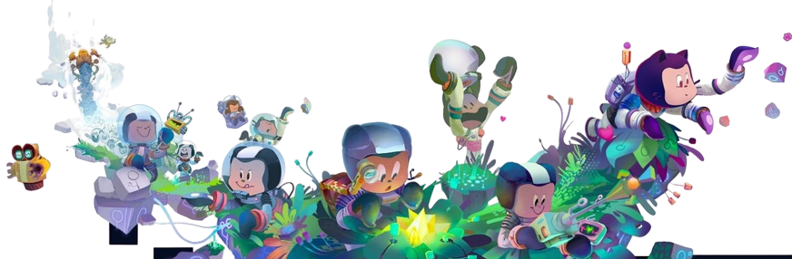
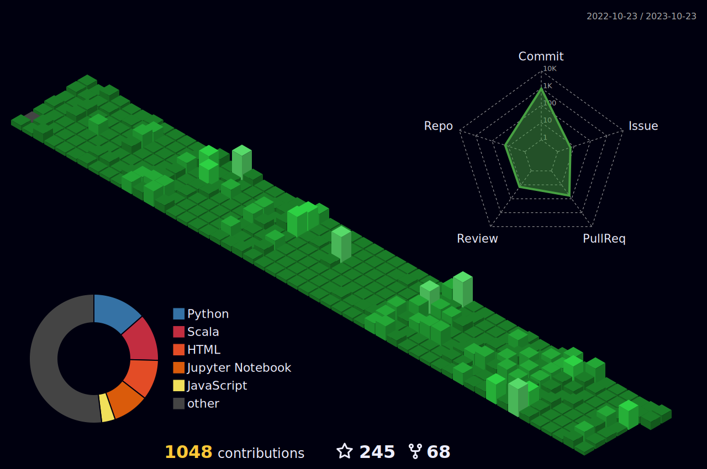

 <a href="https://linkedin.com/in/samadpls" target="_blank">

  

</a>

 

<p align="center"> 
   Visitor count:
   
    
 

 

#   About Me:

- Hello🤍, my name is <a href="https://linkedin.com/in/samadpls" target="blank">Abdul Samad,👨‍💻</a> and I'm a student at UIT studying software engineering. an introvert who chose computer science so that they could work alone. But who would have guessed that I would develop a passion for programming. Python🐍 is my favourite programming language, and I love solving issues. One of the areas where I gained the most knowledge was GitHub.I'm interested in the backend-development, data science, and JavaScript. Aim to contribute to the developer community.
------

🔭 I’m currently working on Web Development 🌱 I’m currently learning Data Science 💬 Ask me about Python, HTML & CSS, Vs Code 👨🏼‍💻 Tech Geek, always ready to learn new Technologies/Frameworks/Languages. 

##  Socials:

 

##  Tech Stack:

|Stats |Streak |Languages 
|---|---|---|
||||

---
<a href='https://github.com/samadpls/'>

</a>

## 🏆 GitHub Trophies

---

 

