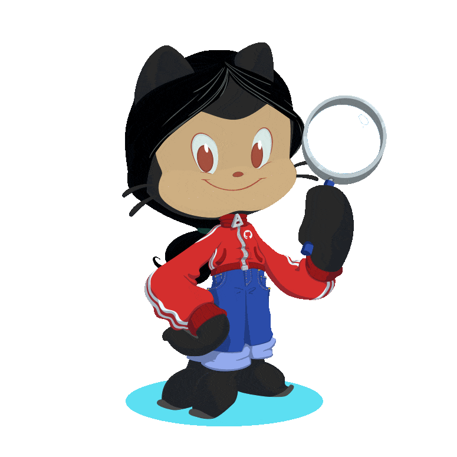

 <a href="https://linkedin.com/in/samadpls" target="_blank">

  

</a>

 

<p align="center"> 
   Visitor count:
   
    
 

# About Me:

- Hi, I am <a href="https://linkedin.com/in/samadpls" target="blank">Abdul Samad🤍</a>, a software engineering👨🏼‍💻 student at UIT. .. An introvert who took computer science to stay alone and do work. But who would knew programming would become my passion. I enjoy solving programming problems and love Python🐍. GitHub is one of the places where I learned the most. I have interest in Data science, front-end and JavaScript. Aim to contribute to the developer community.
------
🔭 I’m currently working on Web Development 🌱 I’m currently learning Data Science 💬 Ask me about Python, HTML & CSS, Vs Code 👨🏼‍💻 Tech Geek, always ready to learn new Technologies/Frameworks/Languages. 

##  Socials:

 

##  Tech Stack:

            

|Stats |Streak |Languages 
|---|---|---|
||||

---
<a href='https://github.com/samadpls/'>

</a>

## 🏆 GitHub Trophies

---

 

